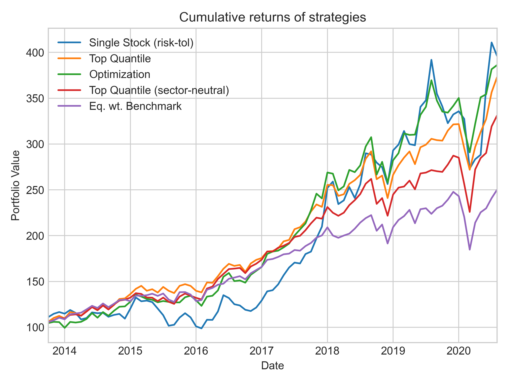
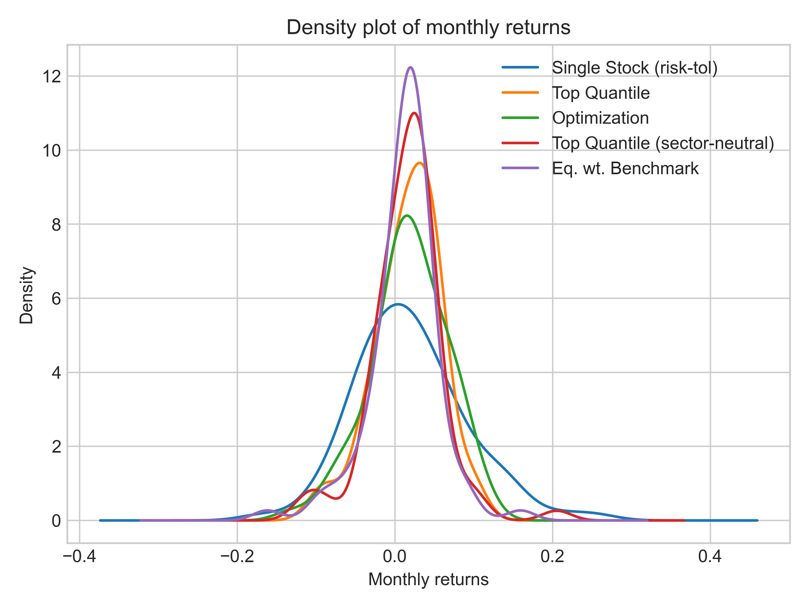

# Assignment Report


## Table of Contents
1. [Choice of momentum signal](#choice-of-momentum-signal)
2. [Choice of benchmarks](#choice-of-benchmarks)
    1. [No Sector Neutrality](#no-sector-neutrality)
    2. [Sector Neutrality](#sector-neutrality)
3. [Backtest Assumptions](#backtest-assumptions)
4. [Strategy Choices](#strategy-choices)
    1. [Both constraints present](#both-constraints-present)
    2. [Single stock constraint removed](#single-stock-constraint-removed)
    3. [Sector Neutrality constraint](#sector-neutrality-constraint)
5. [Technical Implementation](#technical-implementation)
    1. [Make Data](#make-data)
    2. [Make Models](#make-models)
    3. [Make Report](#make-report)
6. [Strategy Results](#strategy-results-and-discussion)
    1.[Metrics for Tearsheet](#metrics-for-tearsheet)
    2.[Tearsheet](#tear-sheet)
7. [Discussion]
    
8. [Appendix]
This report discusses the findings of different strategies using momentum signal and the technical implementation using the raw data of nearly 10 years history of stock prices for 110 stocks.

- Single stock strategy
- Singel stock strategy (risk-tol)
- Top quantile  strategy
- Optimization strategy
- Top quantile strategy (sector-neutrality)


## **Choice of momentum signal**


While there are many ways to measure momentum, based on Jegadeesh 1990 and Fama-French website, the general momentum signal used is [2-12 momentum](http://mba.tuck.dartmouth.edu/pages/faculty/ken.french/Data_Library/det_mom_factor.html), (last 12-month returns, excluding the previous month) when examining intermediate-term momentum (last 12-month returns) effect on stock prices. The last month is excluded to avoid effects from [short-term return reversals](https://alphaarchitect.com/2015/01/14/quantitative-momentum-research-short-term-return-reversal/)

## **Choice of benchmarks**


### **No sector neutrality**
For the strategies without sector neutrality, the best benchmark to be used is an equal weighted index. Many institutions use market-cap weighted benchmarks such as S\&P 500 to measure their portfolio.

Why not use market-cap weighted benchmark in that case? Market-cap weighted benchmarks experience effects due to the SMB factor also known as the [size factor](https://mba.tuck.dartmouth.edu/pages/faculty/ken.french/data_library.html). Market-cap weighted benchmarks give more weight to bigger market-cap stocks. Historically, the momentum factor experienced [negative correlations](https://www.factorresearch.com/research-factor-correlation-check) of nearly -13\% to the size factor. So when we compare our momentum strategy to a market-cap weighted benchmark, noises due to size factor might exist. Equal weighted benchmark will avoid this problem. The equal weighted benchmark definitely fails when there are stocks with very low volume influencing the entire universe of stocks. Since our universe only contains 110 stocks, using an equal weighted benchmark will not be a problem.


### **Sector neutrality**
In case of sector neutrality, the best benchmark to be used is a variation of equal weighted benchmark. Since each sector will have equal weight, we should ensure that the benchmark also has equal weights in the sectors. To achieve this, we will assign a weight of 1/11 (there are total of 11 sectors) to each sector, and among each sector we will weigh the stocks equally

This ensures that we have an apples to apples comparison when strategies with sector neutrality are considered

## **Backtest Assumptions**
The following are the backtest assumptions used for some or all of the strategies

- Every strategy will be rebalanced monthly to avoid excessive trading
- Risk free rate is assumed to be 0
- All portfolios will be fully-invested with no investment in risk-free asset
- No transaction costs (both explicit and implicit) are assumed to make the problem simpler
- Covariances, variances, and volatilities are calculated using past 3-year daily returns history (as its one of simple and popular way followed)
- Geometric returns are used to compute stock returns instead of log returns (Even though, the log returns are popular in academics, the practical applications are not applicable)
- Risk tolerance of a strategy is defined by its target annualized volatlity
- Backtest starts from 2013-10-31 (To support initial 3 years of data)
- Results are backtested considering all the months after 2013-10-31
- Stock tickers with less than 1 year of trading history will be ignored for strategy as of that month

The following assumptions/considerations are NOT followed
- There is no testing set defined, even though the right way to test our results is to choose the best strategy and test it on unseen test data set at the end, we chose to use the entire dataset for exploring our results. The right way to do it is definitely to have a unseen test set to report results based on the best strategy in cross-validation set.  


## **Strategy choices**


### **Both Constraints Present**

Based on the problem statement, the two contraints are 

1) You can only be invested in one asset at any point in time or none
2) There is no shorting allowed

Based on these constraints, there are two strategies that can be built

- **Single Stock Strategy** - Every month, pick one single stock with the highest momentum signal and trade it for that month
- **Single Stock Strategy(risk-tol)** - Every month, pick one single stock with the highest momentum signal with a constraint on the volatility of less than or equal to some threshold value and trade it for that month

Usually, momentum is highly correlated to volatility as higher-volatlity stocks tend to have higher returns (risk-reward tradeoff). As we are only picking one stock, there is very little diversification benefit, the best way to control idiosyncratic and beta risks is to select a stock only if its volatility is below a certain threshold. The threshold here is considered to be 25% as it's the median annualized volatility of all stocks

### **Single stock constraint removed**


When the first constraint is removed, the only constraint is on the shorting

Most factor strategies are dollar-neutral. The universe of stocks are sorted based on the signal value and broken into n-quantiles. An equal weighted portfolio of the top quantile is bought and another equal weighted portfolio of bottom quantile is shorted. The long-short strategy ensures that the market beta effect is reduced as much as possible. Since our constraint cannot allow us to do that, we can simply trade the equal weighted portfolio of stocks in the top quantile every month. For this exercise, we chose to break the universe into 5 quantiles every month based on the momentum signal value. We will call this strategy **Top Quantile Strategy**


Another way to target this problem when the first constraint is removed is to use portfolio optimization.Instead of choosing the equal weighted top quantile, one can find a dynamic portfolio weights that will maximize the value of the ex-ante alpha with constraints on ex-ante portfolio volatility and long-only trading

The equation in pg 383 of Grinold and Kahn(2000) shows us how to set up the problem for reference.It is very similar to mean-variance optimization and is a simple quadratic optimization problem with linear constraints. Every month, this optimization will be done based on the new signal values (or ex-ante alphas) and the updated covariance matrix with a targeted volatility of 15%. We will call this strategy **Optimization Strategy**

Even though an appropriate benchmark would be market weighted benchmark (see [efficient-frontier](https://en.wikipedia.org/wiki/Efficient_frontier)), we will still use equal-weighted benchmark for our analysis


### **Sector Neutrality Constraint**


With the first constraint removed and a new constraint on sector-neutrality (equal weights) added, we can simply modify the Quantile Strategy to conform with the new constraint

Instead of sorting the stocks globally based on the signal, we can sort the stocks locally in the sector and pick the portfolio of top nth quantile in each sector. So, the quantile strategy can be implemented for every sector individually and then combined into global portfolio strategy.

By doing a quantile strategy in every sector, we will end up with 11 long-only portfolios. We will then make sure to equally weigh each sector by multiplying the portfolio weights with 1/11 (1 / no. of sectors). This ensures that the weights of the sectors are equal and the total sum of the portfolio weights is equal to 1. We will call this strategy **Top Quantile Strategy (sector-neutral)**

Other ways of acheiving sector neutrality is to subtract each stock's signal value with its respective average sector signal value. While this ensures that our signal is neutral to sectors, it doesn't ensure equal weightings of sectors in the portfolio.

The optimization strategy can also be enhanced by adding additional constraints in the problem. But we will not be discussing those methods in this report

## Technical Implementation

The project is executed using 3 important scripts and 2 modules

Scripts:

1. `src/make_dataset.py` - Make Data
2. `src/make_models.py` - Make models
3. `src/make_report.py` - Make report

Modules:

1. `src/strategies.py` 
2. `src/portfolio.py`


### **Make Data** 

In order to conduct our analysis, we need to convert our raw data(`data/raw/qr_lead_hw_data_candidate.csv.gz`) into datasets that are suitable for modeling using the `src/make_dataset.py` script


To run this script, run the following command

```
py src/make_dataset.py
```


The python script [make_dataset.py](../src/data/make_dataset.py) converts the raw data into the following important csv files


- `data/processed/monthly_returns.csv` - This file stores monthly returns of each stock with the columns as stock tickers, rows as monthly dates and values as the monthly returns corresponding to the row and column. The monthly returns are calculated using adjusted close prices for accurate represntation of returns adjusted for dividends, stock splits etc.

- `data/processed/signal.csv` - This file stores the signal values of each stock with the columns as stock tickers, rows as monthly dates and values as the monthly returns corresponding to the row and column

- `data/processed/monthly_vol.csv` - This file stores monthly annualized volatilities using past 3 years history of each stock with the columns as stock tickers, rows as monthly dates and values as the annualized vaolatility corresponding to the row and column

- `data/processed/sectors.csv` - This file contains two columns, the first column represents the stock ticker and the second column reprsents the sector it belongs to

- `data/processed/eqwt_benchmark_returns.csv` - This is the equal weighted benchmark monthly time series of returns

- `data/processed/sector_eqwt_benchmark_returns.csv` - This is the sector adjusted equal weighted benchmark monthly time series of returns

### **Make Models**

After these files are created, the next script that needs to be run is `src/make_models.py`. This script builds the strategies, computes the portfolio weights for every month and calculates the realized portfolio returns using the stock returns provided

To run the full script, run the following commmand

```
py src/make_models.py
```

This script uses the `src/strategies.py` module that has class implementations of different strategies

As an example, a single stock strategy can be implemented by using the following block of code

```
import pandas as pd
from strategies import SingleStockStrategy

signal_df = pd.read_csv('data/processed/signal.csv',index_col = 0,parse_dates = True)
stock_returns = pd.read_csv('data/processed/stock_returns.csv', index_col = 0, parse_dates = True)

# Initialize a strategy and calculate portfolio weights and realized returns every month
strat = SingleStockStrategy(signal_df) 
strat.compute_weights()
portfolio_weights = strat.get_weights()
portfolio_returns = strat.compute_returns(stock_returns)
```

All the 5 strategies are run in a similar fashion and their results are dumped into `data/results` folder


### **Make Report**

The final script `src/make_report.py` uses the results from the strategies and prepares a tearsheet and figures corresponding to the strategy. To run the script, simply run the command

```
py src/make_report.py
```

This script uses the `src/portfolio.py` module that has a class implementation of a tearsheet of a strategy. For example, the following block of code will show how the tearsheet can be run

```
from portfolio import TearSheet

tear_sheet = TearSheet(strategy_returns, weights, benchmark_returns, frequency = 'monthly')
tear_sheet.compute_results()
results = tear_sheet.get_results()

print(results)
```

The script dumps the tearsheet results as `reports/tearsheet.csv` and puts any related figures in the `reports/figures` folder


## Strategy Results


### Metrics for tearsheet
After running the 5 different strategies, the metrics considered for tearsheets are the 


1. Mean - Annualized mean return
2. Volatility - Annualized volatlity
3. Sharpe - Mean / Vol
4. Skew - skewness of the strategy
5. Kurtosis - Kurtosis of the strategy
6. Adjusted Sharpe - Sharpe ratio adjusted for skewness and kurtosis See details section in this [link](https://rdrr.io/cran/PerformanceAnalytics/man/AdjustedSharpeRatio.html) 
7. Max drawdown
8. Beta - Portfolio beta to the benchmark
9. Alpha (annualized) - mean of the residual of regression of portfolio returns to the benchmark returns
10. IR - Information ratio (ratio of alpha to the residual volatility)
11. p-value(Sharpe-ratio) - p-value of the mean or the sharpe ratio
12. p-value(IR) - p-value of the alpha or the IR


### Tear Sheet

| Metric       | Single stock | Single Stock(risk-tol) | Top Quantile | Optimization | Eq.wt benchmark | Top Quantile(sector-neutral) | Sector eq.wt benchmark |
|--------------|:------------:|:----------------------:|:------------:|:------------:|:---------------:|:----------------------------:|:----------------------:|
| Mean         |    57.87%    |         22.90%         |    20.23%    |    21.12%    |     14.44%      |            18.6%             |         14.44%         |
| Volatility   |    46.55%    |         24.37%         |    14.55%    |    17.00%    |     14.92%      |            15.44%            |         14.86%         |
| Sharpe       |     1.24     |          0.93          |     1.39     |     1.24     |      0.96       |             1.20             |          0.97          |
| Skew         |    -0.21     |          0.54          |    -0.55     |    -0.43     |      -0.71      |             0.23             |         -0.69          |
| Kurtosis     |     0.89     |          0.90          |     0.45     |     0.25     |      3.94       |             4.24             |          3.82          |
| Adj.Sharpe   |     1.12     |          0.99          |     1.16     |     1.11     |      0.71       |             0.95             |         0.712          |
| Drawdown(%)  |   44.77 %    |         30.28%         |    17.46%    |    21.29%    |     25.46%      |            21.38%            |         25.25%         |
| Beta         |     0.11     |          0.30          |     0.86     |     0.59     |       1.0       |             0.89             |          1.0           |
| Alpha        |    8.12%     |         7.55%          |    -3.04%    |    1.94%     |      0.0%       |            -2.17%            |          0.0%          |
| IR           |     0.18     |          0.34          |    -0.39     |     0.15     |      <NA>       |            -0.37             |          <NA>          |
| Turnover(%)  |     607%     |         1156%          |     562%     |     774%     |      <NA>       |             603%             |          <NA>          |
| p-val(mean)  |    0.0021    |         0.0056         |    0.0015    |    0.0022    |      0.033      |            0.0071            |         0.0314         |
| p-val(alpha) |     0.32     |          0.19          |     0.84     |     0.34     |      <NA>       |             0.83             |          <NA>          |


## Discussion

### Both constraints present

When both the constraints are present, the **Single stock** and **Single stock (risk-tol)** are applicable. We find that without any risk-tolerance, the **Single stock** has a whopping annualized mean return of nearly 58% with a annualized volatility of nearly 47%. This is somewhat expected, as momentum signal is highly correlated to the volatility factor. The strategy is probably picking up high volatility stock every month whose return might be largely driven by the stock's idiosyncratic risk. As idiosyncratic risk cannot be diversified with a single stock every month, the volatility remains very high. 

 We also observe that this strategy has the highest drawdown due to its high volatility nature. Due to its high idiosyncratic nature, the alpha and beta are respectively high and low. But the Information Ratio is very low due to the high residual volatility. The hypothesis test for the mean returns passes at 99% significance that the mean is greater than 0. But the hypothesis test for the alpha fails even at 90% confidence. 

But when we add an additional contraint on the single stock strategy to not pick any stock that has higher than 25% volatility, the results are quite different. The mean return and volatlity of the **Single stock(risk-tol)** are reasonable at 22-24%. The Sharpe ratio remains similar to **Single stock** strategy and information ratio is slightly higher compared to the former strategy. The p-value of the alpha is slighly better than the former strategy but still fails even the 90% confidence test

The only plus points of this strategy is its chance of getting high returns similar to a fundamental strategy of stock picking. Professionals using this strategy should carefully look into the stock to be traded every month and take cautious decisions. The drawbacks of this strategy are definitely its high idiosyncratic risk/volatility and very high drawdown. 

### Single stock constraint removed

When the single stock constraint is removed, **Top Quantile** and **Optimization** strategies are applicable. We observe that the **Top-Quantile** has a better profile of returns when compared to the *Single stock** strategy with reasonable returns and volatility. It has the lowest drawdown and turnover as well due to its diversification benefits of trading more than 1 stock. Even though the mean is significant at 99% level, the alpha is actually a negative value indicating there was no alpha generated in the backtest for this strategy. The beta of the portfolio is much higher indicating that the idiosyncratic risk of this strategy is much lower compared to Single stock strategies

This strategy might not be that useful if there is a long-only constraint. If there is a short constraint, there is probably a chance that alpha might be with the short portfolio of stocks cancelling out the negative effects.

On ther other hand **Optimization** strategy does better in all fronts compared to the single stock strategies and top quantile strategy, it has nearly 21% annualized mean return with 17% volatility as the ex-ante target volatility was set at 15%. Even though the information ratio or the alpha is not that significant even at 90% confidence, it is better when compared when compared to the previous strategies with the exception of **Single stock(risk-tol)**

This strategy should be chosen in case of long-only constraints as it not only provides diversification benefits but only optimizes the alpha by dynamically setting the weights of the stock. The drawbacks of this strategy due to its technical implementation, one can run into low-rank covariance matrix or even suffer problems from data-mining. These problems can be avoided by using shrinkage methods or PCA and setting up proper train, validation and test experiments

### Sector Neutrality constraint
When the sector neutrality consraint is introduced, we can apply the top quantile strategy in each sector separately and combine an equal weighted sector portfolio. We find the **Top quantile(sector-neutrality)** has similar results when compared to **Top quantile** strategy. One can also see in the appendix that it has high correlations to the former strategy as well. This is due to matching high alpha unique stocks in the both of the portfolios. This strategy also has a negative alpha similar to the former strategy

One can improve upon this strategy by using optimization strategy using additional constraints on the sector weights.

Even though sector-neutral strategy might not outperform one with no constraints on sectors, this strategy will be very helpful to avoid effects due to industry bubble bursts. For example, prior to the year 2001, the Tech stocks had very high momentum up until the 2001 Dot Com bubble burst, With no constraints on the sectors, the unconstrained strategy might have been overweight in the tech sector which could have resulted in a big disaster in the year 2001. The sector-neutral strategy would still faces but will be in a much better position than the one without constraints 


### Final Recommendation

The final recommendation is to use an optimization strategy with sector constraints. Even though it might not have a significant alpha, it might have a better profile than all of the strategies above.


## Appendix

### Correlations

|                               | Single Stock (risk-tol) | Top Quantile | Optimization | Top Quantile (sector-neutral) | Eq. wt. Benchmark |
|:------------------------------|------------------------:|-------------:|-------------:|------------------------------:|------------------:|
| Single Stock (risk-tol)       |                       1 |         0.66 |         0.68 |                          0.56 |              0.49 |
| Eq. wt. Benchmark             |                    0.49 |         0.84 |         0.67 |                          0.93 |                 1 |
| Optimization                  |                    0.68 |         0.86 |            1 |                          0.79 |              0.67 |
| Top Quantile (sector-neutral) |                    0.56 |          0.9 |         0.79 |                             1 |              0.93 |
| Top Quantile                  |                    0.66 |            1 |         0.86 |                           0.9 |              0.84 |

### Figures





